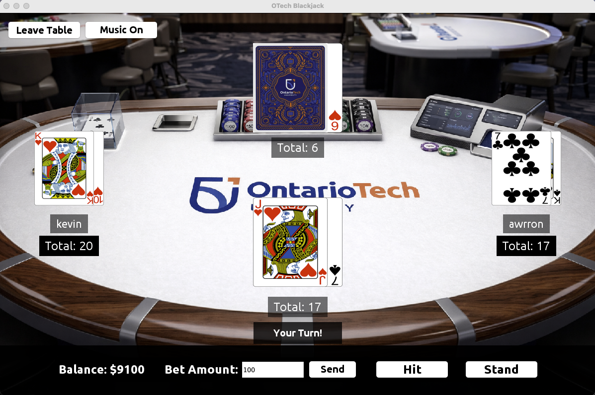

# OTech_BlackJack

OTech_BlackJack is a Ontario Tech University themed BlackJack with multiplayer functionality. OTech_BlackJack was developed with Maven, JSwing (front end), Java (back end), and SQLite (database). OTech_BlackJack features a betting function, cards and tables with an Ontario Tech inspired design and multiplayer capabilities (up to 3 players at a table). Players can create their own account complete with a starting balance of $10,000 and can add funds whenever they like. After logging in, players can create their own public tables to start playing or join other tables with their friends to play against each other and the dealer. We hope you will enjoy Ontario Tech Blackjack!

## Technical Features 
- User account creation and login 
- Password storage with encryption (BCrypt hashing)
- SQLite database for storing login credentials and account balances
- Multiplayer blackjack tables
- Client-server communication using sockets
- Multithreaded server to support multiple connected players live
- Table lobby with active table list and join options
- Automatic round progression and game state updates

## Video Demo: 
### [Please Click Here](https://drive.google.com/file/d/1i6s_HDHFzvN3d7ByuyxPQUV5q5ZpxPwy/view?usp=sharing)

## Project Structure

### Frontend
```txt
|--- GUIClasses
|   |--- pages
|   |   |--- CreateAccountPage.java
|   |   |--- GamePage.java
|   |   |--- LoginPage.java
|   |   |--- LobbyPage.java
|   |
|   |--- styling
|       |--- BackgroundMusic.java
|       |--- BackgroundPanel.java
|       |--- CustomFont.java
|
|--- Client.java
|--- GUI.java
```

### Backend
```txt
|--- Card.java
|--- Game.java
|--- LoginHandler.java
|--- Player.java
|--- Table.java
|--- TableManager.java
```

### Database
```txt
|--- DatabaseManager.java
|--- InitializeDB.java
```
### Server
```txt
|--- ClientConnectionHandler.java
|--- Server.java
```

## Blackjack Rules Integrated

- Bets are taken at the beginning of each round just before cards are dealt
- Each player is dealt 2 cards and plays against the dealer
- The dealer's second card is hidden.
- Players may choose to hit or stand on their turn
- If a player exceeds 21, they lost
- If a player gets closer to 21 than the dealer without busting, they win 
- If the dealer busts, eligible remaining players win
- If both the player and dealer have the same total, the result is a draw
- Wins reward double the bet and draws refund bets.
- Rounds restart automatically after results are shown


## Login Page


## Lobby Page


## Single Player


## Multiplayer


## Live Round Updates


## Database Sample Entries


## How to run
Below are the steps on how to get Ontario Tech Blackjack running on your computer. Please note that in order to run the app, an Integrated Development Environment is needed to clone the repository (Intellij IDEA IDE is recommended). Java version <ADD JAVA VERSION HERE> or more recent is also needed.
- 1: On the main menu of the github repo of the project, click the green button that says `<> Code` and copy the `HTTPS` link to your clipboard.
- 2: Open your preferred terminal and navigate to the directory you want to clone the program into. You can also create a new folder to store it in.
- 3: Once you are in the desired directory, type `git clone <PASTE URL HERE>` into the command line and press enter. Once finished cloning, you can open the project in your preferred IDE
- 5: Locate the Server java file (`src\main\java\server`) and double click to open. you can run this file by pressing the green play button at the top of the page.
- 6: Next, locate the Client java file (`src\main\java\frontend`) and double click it to open. run this file with the green play button and you're now ready to start Ontario Tech BlackJack!
  ### Important Notes
    - When starting up the application, **Always** run the Server file before running the Client file. Running Client first will cause an error.
    - In order to use multiplayer features, you must enable multiple client instances to be run at the same time. You can enable this by navigating to **Run -> Edit Configurations -> Client -> Modify Options** and checkmark the 'Allow multiple instances' option to have multiple players on one device at a single time.


## Authors
Kevin Khuu & Awrron Kavian